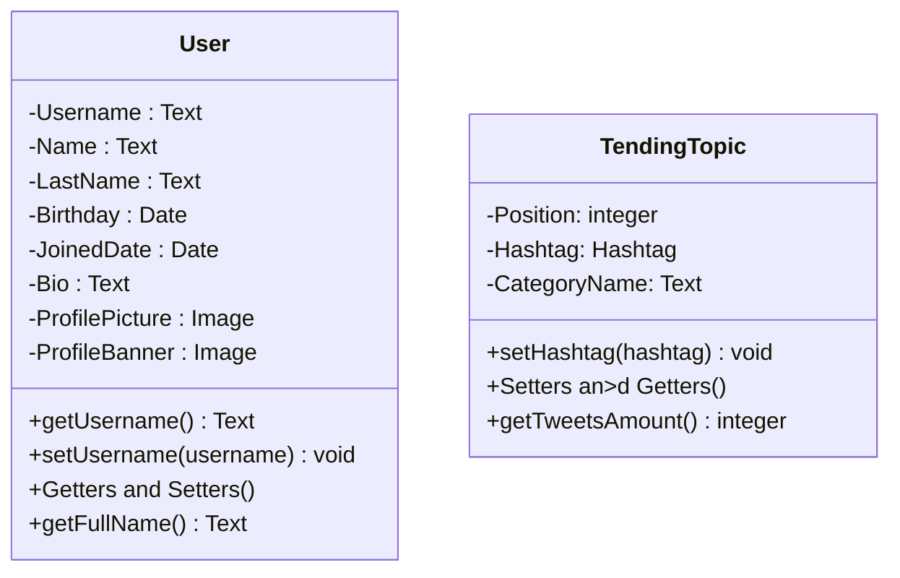
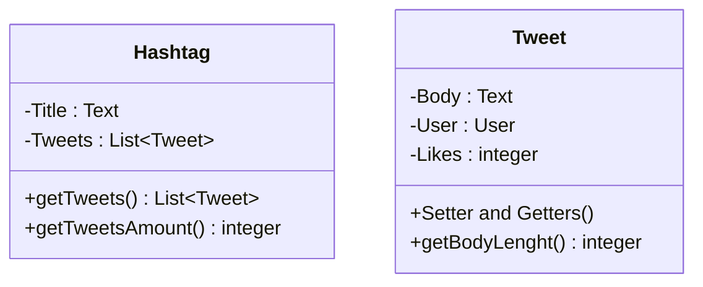
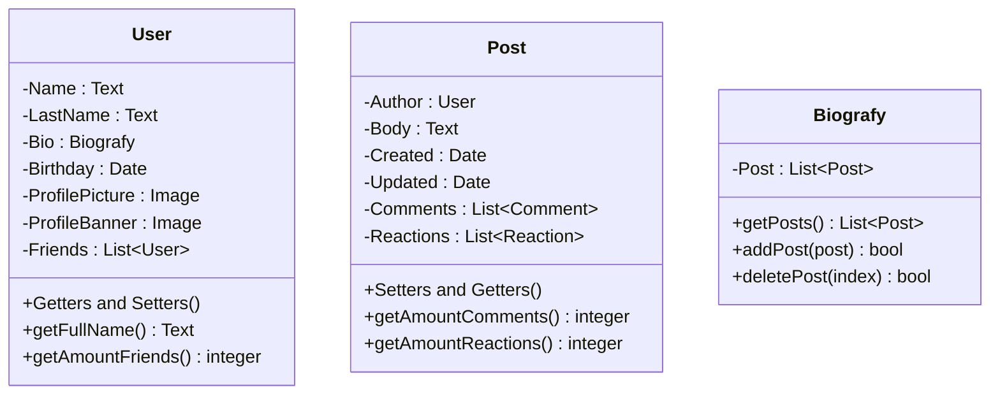

# Modelado de Twitter

# Modelado de Facebook

# Modelado de Uber

~~~mermaid
    classDiagram
    class Profile{
        -Username : Text
        -Raiting : integer
        -Reviews : List~Review~-
        -Car : Text
        +Getters and Setters()
        -setRaiting() integer
        +addReview(review) bool
    }
    class Travel{
        -Destination : Text
        -Begin : Text
        -Duration : integer
        -Distance : integer
        +Setters and Getters()
        +detailsOfTravel() Text
    }
    class Review{
        -Rate : integer
        -Title : Text
        -Body : Text
        -Travel : Travel
        +Setters and Getters()
        +getDetailsOfReview() Text
    }
~~~